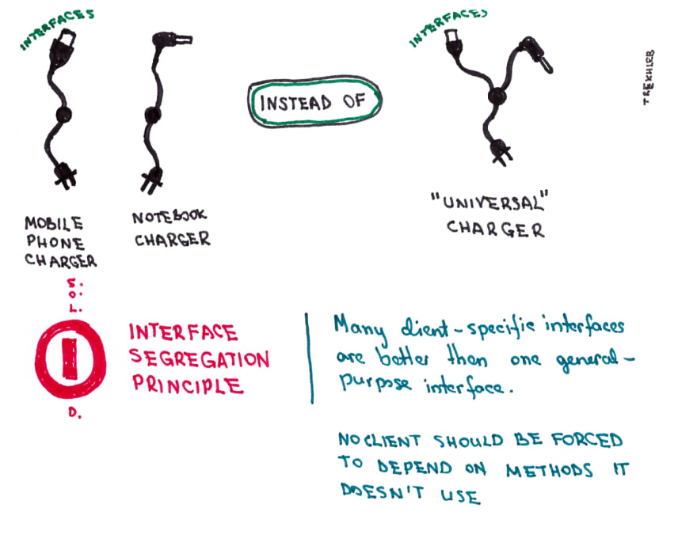

# Design-patterns

## Base de l'OO

```
- Abstraction

- Encapsulation

- Polymorphisme

- Héritage
```

## Principes OO

```
- Encapsulez ce qui varie.

- Préférer la composition à l'héritage.

- Programmer des interfaces, non des implémentations.

- Efforcez-vous de coupler faiblement les objets qui interagissent.

- Les classes doivent être ouvertes à l'extension mais fermées à la modification.

- Dépendez des abstractions. Ne dépendez pas des classes concrêtes.

- Restreindre les intéractions entre objets à quelques classes proches.

- Les super-classes décident quand appeler les sous-classes.

- Une classe ne doit avoir qu’une seule raison de changer.
```

## Patterns OO

Un pattern est une solution à un problème dans un contexte.

__Stratégie__ <br/>
Définit une famille d'algorithmes, encapsule chacun d'eux et les rend interchangeables. Stratégie permet à l'algorithme de varier indépendamment des clients qui l'utilisent.

__Observateur__ <br/>
Définit une relation entre objets de type un-à-plusieurs, de façon que, lorsque un objet change d'état, tous ceux qui en dépendent en soient notifiés et soient mis à jour automatiquement.

__Décorateur__ <br/>
Attache des responsabilités supplémentaires à un objet de façon dynamique. Il permet une solution alternative pratique à la dérivation pour étendre les fonctionnalités.

__Fabrication__ <br/>
Définit une interface pour la création d'un objet, mais en laissant aux sous-classes le choix des classes à instancier. Fabrication permet à une classe de déléguer l'instanciation à des sous-classes.

__Singleton__ <br/>
Garantit qu'une classe n'a qu'une seule instance et fournit un point d'accès de type global à cette instance.

__Commande__ <br />
Encapsule une requête comme un objet, autorisant ainsi le paramétrage des clients par différentes requêtes, files d'attente et récapitulatifs de requêtes, et de plus, permettant la réversibilité des opérations.

__Adaptateur__ <br />
Convertit l'interface d'une classe en une autre conforme à celle du client. L'adaptateur permet à des classes de collaborer, alors qu'elles n'auraient pas pu le faire du fait d'interfaces incompatibles.

__Façade__ <br />
Fournit une interface unifiée à l'ensemble des interfaces d'un sous-système. La façade fournit une interface de plus haut niveau qui rend le sous-système plus facile à utiliser.

__Patron de méthode__ <br />
Définit le squelette d'un algorithme dans une méthode, en déléguant certaines étapes aux sous-classes. Il permet aux sous-classes de redéfinir certaines étapes d'un algorithme sans modifier la structure de celui-ci.

__Itérateur__ <br />
Fournit un moyen d'accéder en séquence à un objet de type agrégat sans révélé sa représentation sous-jacente.

__Composite__ <br />
Compose des objets en des structures arborescentes pour représenter des hiérarchies composant/composé. Il permet aux clients de traiter de la même façon les objets individuels et les combinaisons de ceux-ci.

__Etat__ <br />
Permet à un objet de modifier son comportement quand son état interne change. Tout se passera comme si l'objet changeait de classe.

__Proxy__ <br />
Fournit un remplaçant à un autre objet, pour en contrôler l'accès.

## Principes SOLID

__Single Responsibility Principle__ <br/>  

<br/>

__Open/Close Principle__ <br />

<br/>

__Liskov Substitution Principle__ <br />

<br/>

__Interface Segregation Principle__ <br />

<br/>

__Dependency Inversion Principle__ <br />

<br/>

